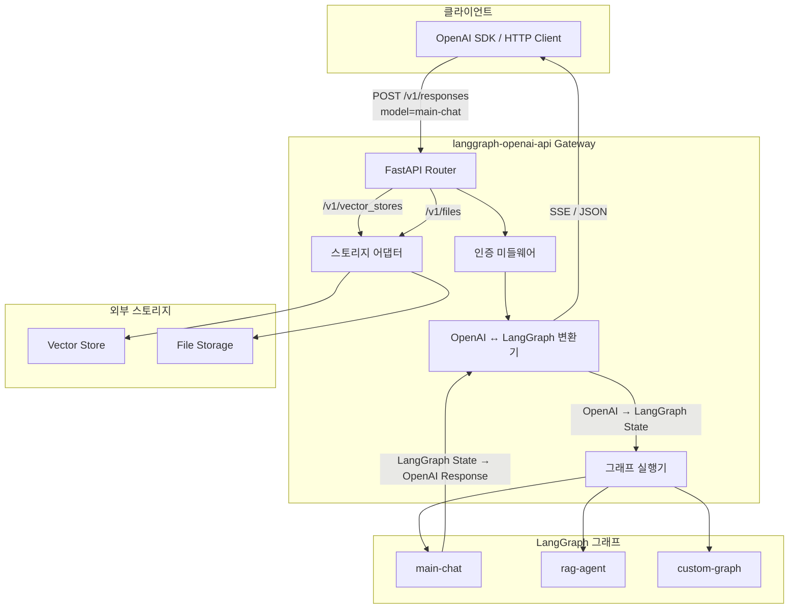
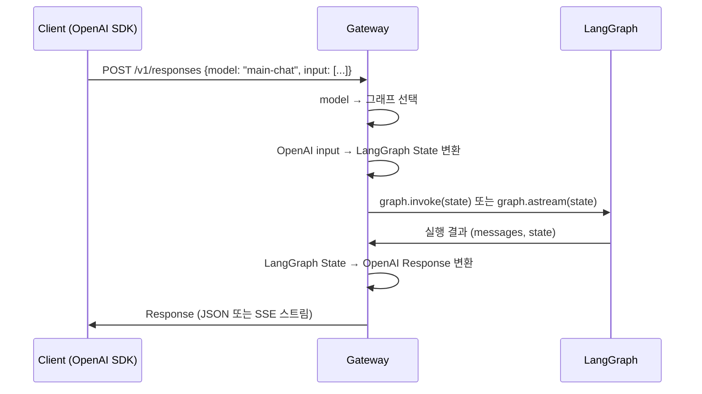

# 01. 프로젝트 개요

## 개요

`langgraph-openai-api`는 LangGraph 그래프를 **OpenAI 호환 API**로 서빙하는 FastAPI 기반 게이트웨이 라이브러리입니다.

`langgraph.json`에 등록된 그래프들을 자동으로 OpenAI Responses API 호환 엔드포인트로 노출하여,
기존 OpenAI SDK/클라이언트로 LangGraph 에이전트를 호출할 수 있게 합니다.

---

## 핵심 문제

| 문제 | 설명 |
|------|------|
| 공식 래퍼 부재 | LangGraph에는 OpenAI-compatible API 래퍼가 존재하지 않음 |
| 배포 환경 제약 | LangSmith를 사용할 수 없는 환경에서 별도 API 배포 환경 필요 |
| SDK 호환성 | 기존 OpenAI SDK 기반 클라이언트를 재사용하고 싶은 요구 |

---

## 핵심 개념: Graph = Model

`langgraph-openai-api`의 가장 중요한 개념은 **Graph를 Model로 매핑**하는 것입니다.

```
OpenAI API의 model 파라미터  →  LangGraph 그래프 선택
```

| OpenAI 요청 | langgraph-openai-api 동작 |
|------------|--------------------------|
| `model="main-chat"` | `langgraph.json`의 `main-chat` 그래프 실행 |
| `model="rag-agent"` | `langgraph.json`의 `rag-agent` 그래프 실행 |
| `GET /v1/models` | 등록된 모든 그래프 목록 반환 |

---

## 지원 API

OpenAI Responses API를 기반으로 다음 엔드포인트를 지원합니다.

| 엔드포인트 | 메서드 | 설명 |
|-----------|--------|------|
| `/v1/responses` | POST | 그래프 실행 (스트리밍/논스트리밍) |
| `/v1/responses/{id}` | GET | 응답 조회 |
| `/v1/responses/{id}/input_items` | GET | 입력 항목 조회 |
| `/v1/models` | GET | 등록된 그래프(모델) 목록 |
| `/v1/models/{model}` | GET | 특정 그래프(모델) 정보 |
| `/v1/vector_stores` | CRUD | 벡터 스토어 관리 (어댑터 위임) |
| `/v1/vector_stores/{id}/files` | CRUD | 벡터 스토어 파일 관리 |
| `/v1/vector_stores/{id}/search` | POST | 벡터 스토어 검색 |
| `/v1/files` | CRUD | 파일 업로드/관리 (어댑터 위임) |

---

## 기술 스택

| 구성요소 | 기술 |
|---------|------|
| API 프레임워크 | FastAPI |
| 그래프 엔진 | LangGraph |
| LLM 통합 | LangChain |
| 스트리밍 | SSE (Server-Sent Events) |
| 설정 | `langgraph.json` (LangGraph Platform 호환) |
| CLI | `openlang` (dev / build / serve) |
| 배포 | PyPI (`pip install langgraph-openai-api`) |
| 인증 | API Key Bearer 토큰 |

---

## 아키텍처 다이어그램



---

## 데이터 흐름 요약



---

## 프로젝트 구조

```
langgraph-openai-api/
├── pyproject.toml
├── langgraph.json              # 그래프 등록 설정
├── src/
│   └── langgraph_openai_api/
│       ├── server/             # FastAPI 앱, 미들웨어
│       ├── routers/            # 엔드포인트 라우터
│       ├── translators/        # OpenAI ↔ LangGraph 변환
│       ├── graph/              # 그래프 로더, 실행기
│       ├── adapters/           # 스토리지 어댑터 (ABC)
│       ├── models/             # Pydantic 모델 (OpenAI 스키마)
│       └── cli/                # openlang CLI
├── tests/
└── docs/
```

---

## 관련 문서

- [02. 빠른 시작](./02-quick-start.md) - 5분 시작 가이드
- [04. 내부 아키텍처](./04-architecture.md) - 모듈 상세 구조
- [05. API 명세](./05-api-specification.md) - 엔드포인트 상세 스펙
- [03. 설정](./03-configuration.md) - langgraph.json 상세
- [10. CLI 레퍼런스](./10-cli-reference.md) - openlang 명령어
