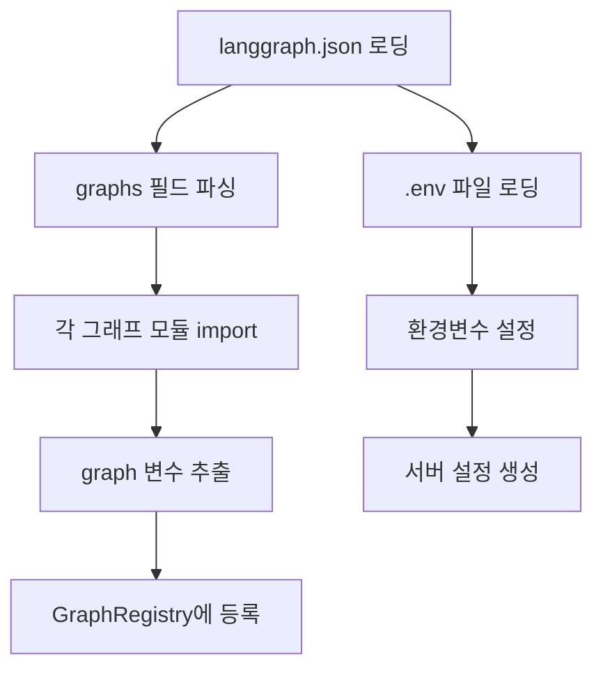

# 03. 설정

## 개요

`langgraph-openai-api`의 설정 파일 형식, 그래프 등록 방법, 환경변수, 프로젝트 구조를 정의합니다.
설정 파일은 LangGraph Platform의 `langgraph.json`과 호환됩니다.

---

## langgraph.json

### 기본 구조

```json
{
  "dependencies": ["."],
  "graphs": {
    "main-chat": "./src/agents/main_chat/graph.py:graph",
    "rag-agent": "./src/agents/rag/graph.py:graph",
    "code-assistant": "./src/agents/code/graph.py:graph"
  },
  "env": ".env"
}
```

### 필드 상세

| 필드 | 타입 | 필수 | 설명 |
|------|------|------|------|
| `dependencies` | array | Yes | Python 패키지 의존성 경로 |
| `graphs` | object | Yes | 그래프 ID → 모듈 경로 매핑 |
| `env` | string | No | 환경변수 파일 경로 (기본: `.env`) |

### graphs 필드 형식

```
"<graph-id>": "<module-path>:<variable-name>"
```

| 요소 | 설명 | 예시 |
|------|------|------|
| `graph-id` | 그래프 고유 ID (= OpenAI model 이름) | `main-chat` |
| `module-path` | 그래프 모듈의 상대 경로 | `./src/agents/main_chat/graph.py` |
| `variable-name` | 그래프 인스턴스 변수명 | `graph` |

#### 예시

```json
{
  "graphs": {
    "main-chat": "./src/agents/main_chat/graph.py:graph",
    "enterprise--collections": "./src/agents/enterprise/collections/graph.py:graph"
  }
}
```

위 설정에서:
- `model="main-chat"` → `src/agents/main_chat/graph.py`의 `graph` 변수 실행
- `model="enterprise--collections"` → `src/agents/enterprise/collections/graph.py`의 `graph` 변수 실행

---

## Graph ID → Model Name 규칙

Graph ID는 OpenAI API의 `model` 파라미터와 1:1로 매핑됩니다.

### 네이밍 규칙

| 규칙 | 설명 | 예시 |
|------|------|------|
| 소문자 + 하이픈 | kebab-case 사용 | `main-chat` |
| 네임스페이스 | `--` (더블 하이픈)으로 구분 | `enterprise--main-chat` |
| 영문 + 숫자만 | 특수문자 제한 | `rag-v2` |

### 매핑 예시

| Graph ID (langgraph.json) | OpenAI model 파라미터 | GET /v1/models 응답 |
|---------------------------|---------------------|-------------------|
| `main-chat` | `model="main-chat"` | `{"id": "main-chat", ...}` |
| `enterprise--rag` | `model="enterprise--rag"` | `{"id": "enterprise--rag", ...}` |

---

## 프로젝트 구조

`langgraph-openai-api`를 사용하는 그래프 프로젝트의 권장 구조:

```
my-graph-project/
├── langgraph.json              # 그래프 등록
├── .env                        # 환경변수
├── pyproject.toml              # 프로젝트 의존성
├── src/
│   └── agents/
│       ├── main_chat/
│       │   ├── __init__.py
│       │   ├── graph.py        # graph = builder.compile()
│       │   ├── state.py        # InputState, FullState
│       │   └── nodes.py        # 노드 함수들
│       └── rag/
│           ├── __init__.py
│           ├── graph.py
│           ├── state.py
│           └── nodes.py
├── adapters/                   # 스토리지 어댑터 구현 (선택)
│   ├── vector_store.py
│   └── file.py
└── tests/
```

### 최소 프로젝트

```
minimal-project/
├── langgraph.json
├── .env
├── graph.py                    # 단일 그래프
└── requirements.txt
```

```json
// langgraph.json
{
  "dependencies": ["."],
  "graphs": {
    "my-agent": "./graph.py:graph"
  }
}
```

---

## 환경변수

### 게이트웨이 환경변수

| 변수 | 설명 | 기본값 |
|------|------|--------|
| `OPENLANG_API_KEY` | API 인증 키 | — (필수) |
| `OPENLANG_HOST` | 서버 호스트 | `0.0.0.0` |
| `OPENLANG_PORT` | 서버 포트 | `8000` |
| `OPENLANG_DEV` | 개발 모드 (인증 비활성화) | `false` |
| `OPENLANG_WORKERS` | 워커 수 | `1` |
| `OPENLANG_LOG_LEVEL` | 로그 레벨 | `info` |

### LangGraph / LangChain 환경변수

| 변수 | 설명 |
|------|------|
| `OPENAI_API_KEY` | OpenAI API 키 (그래프에서 사용) |
| `LANGCHAIN_TRACING_V2` | LangSmith 추적 활성화 |
| `LANGCHAIN_API_KEY` | LangSmith API 키 |
| `LANGCHAIN_PROJECT` | LangSmith 프로젝트명 |

> **상세**: 전체 환경변수 목록은 [Appendix A. 환경변수](./appendix/A-environment-variables.md) 참조

---

## .env 파일 예시

```bash
# 게이트웨이 설정
OPENLANG_API_KEY=sk-my-secret-api-key
OPENLANG_HOST=0.0.0.0
OPENLANG_PORT=8000
OPENLANG_DEV=false

# LLM 프로바이더
OPENAI_API_KEY=sk-...
ANTHROPIC_API_KEY=sk-ant-...

# LangSmith (선택)
LANGCHAIN_TRACING_V2=true
LANGCHAIN_API_KEY=ls-...
LANGCHAIN_PROJECT=my-project
```

---

## 설정 로딩 순서



1. `langgraph.json` 파일을 프로젝트 루트에서 로딩
2. `env` 필드로 지정된 `.env` 파일 로딩
3. `graphs` 필드의 각 항목에 대해:
   - 모듈 경로에서 Python 모듈 import
   - 지정된 변수명의 그래프 인스턴스 추출
   - `GraphRegistry`에 Graph ID와 함께 등록
4. 어댑터 설정이 있으면 어댑터 인스턴스 생성 및 등록

---

## 다중 설정 파일

`langgraph.json`의 위치를 환경변수나 CLI 옵션으로 변경할 수 있습니다.

```bash
# 환경변수
OPENLANG_CONFIG=./config/langgraph.json openlang dev

# CLI 옵션
openlang dev --config ./config/langgraph.json
```

---

## 관련 문서

- [01. 프로젝트 개요](./01-project-overview.md) - 전체 그림
- [02. 빠른 시작](./02-quick-start.md) - 최소 설정으로 시작하기
- [10. CLI 레퍼런스](./10-cli-reference.md) - CLI 설정 옵션
- [Appendix A. 환경변수](./appendix/A-environment-variables.md) - 환경변수 마스터 레퍼런스
- [Appendix C. 네이밍 컨벤션](./appendix/C-naming-conventions.md) - Graph ID 네이밍 규칙
