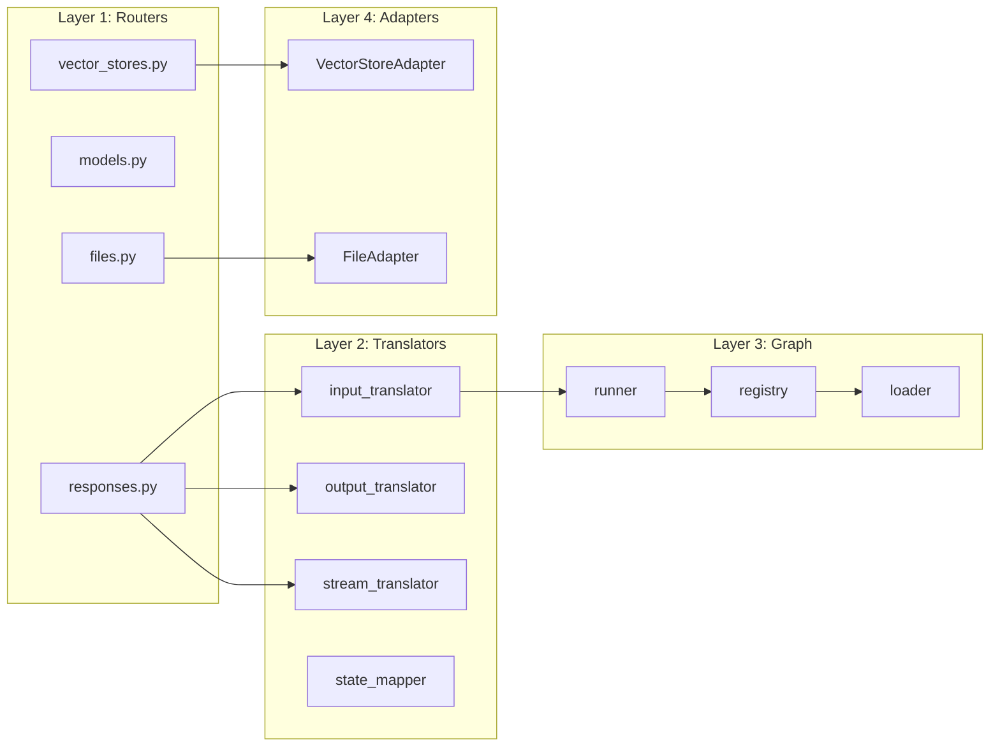
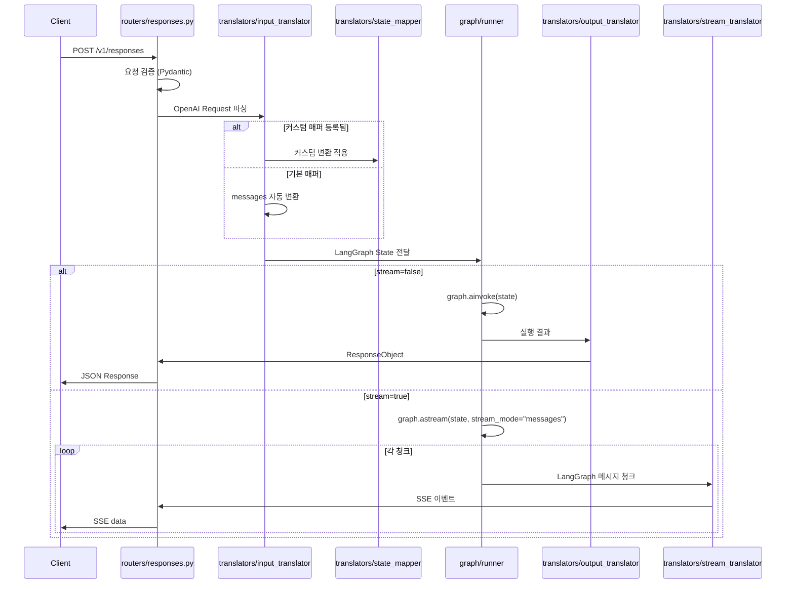
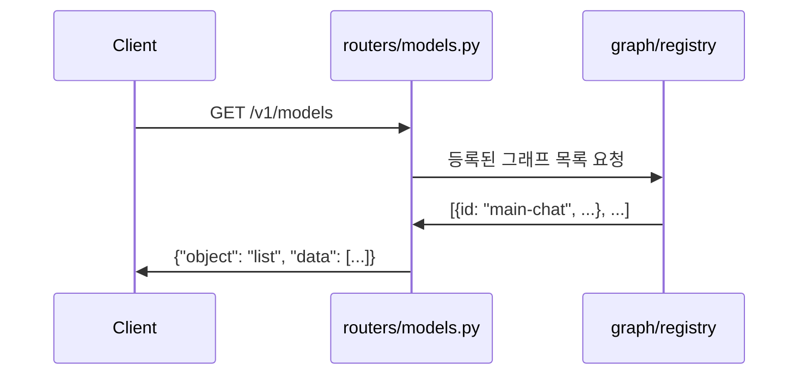
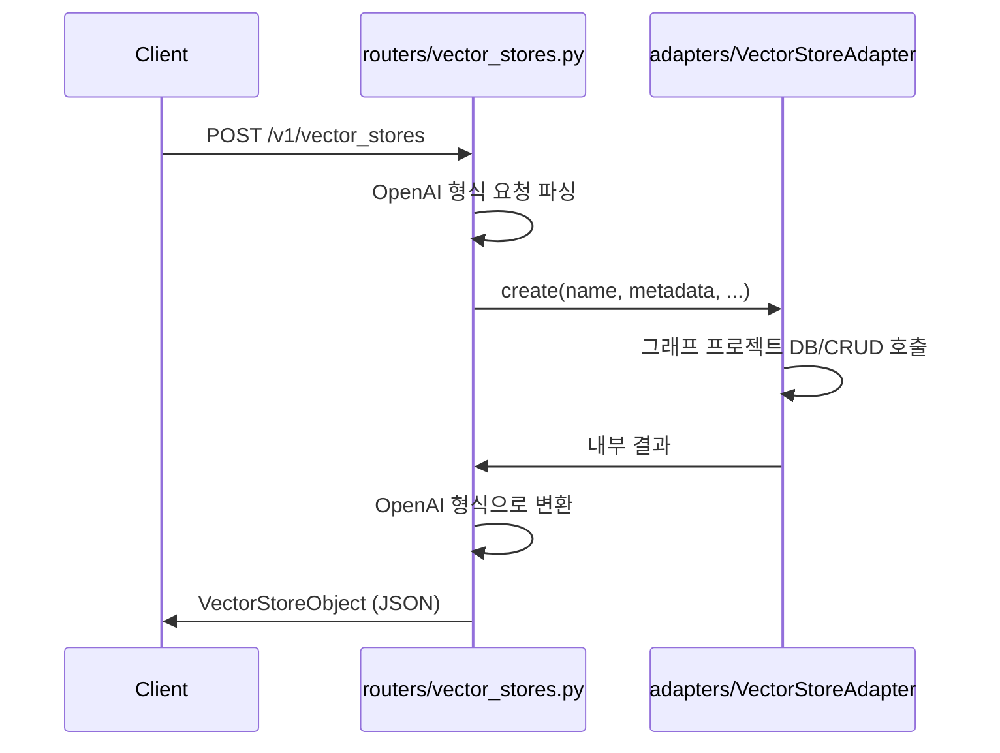

# 04. 내부 아키텍처

## 개요

`langgraph-openai-api` 게이트웨이의 내부 모듈 구조, 레이어별 역할, 데이터 흐름을 정의합니다.
개발 시 이 문서를 기준으로 모듈 간 책임 경계를 준수합니다.

---

## 모듈 구조

```
src/langgraph_openai_api/
├── __init__.py
├── server/                     # 서버 설정 및 앱 팩토리
│   ├── __init__.py
│   ├── app.py                  # FastAPI 앱 생성, 미들웨어 등록
│   └── dependencies.py         # FastAPI Depends (인증, 설정 주입)
├── routers/                    # API 엔드포인트 라우터
│   ├── __init__.py
│   ├── responses.py            # POST /v1/responses, GET /v1/responses/{id}
│   ├── models.py               # GET /v1/models, GET /v1/models/{model}
│   ├── vector_stores.py        # /v1/vector_stores CRUD + 검색
│   └── files.py                # /v1/files CRUD
├── translators/                # OpenAI ↔ LangGraph 형식 변환
│   ├── __init__.py
│   ├── input_translator.py     # OpenAI Request → LangGraph State
│   ├── output_translator.py    # LangGraph State → OpenAI Response
│   ├── stream_translator.py    # LangGraph 스트림 → SSE 이벤트
│   └── state_mapper.py         # 커스텀 State 매퍼 레지스트리
├── graph/                      # 그래프 로딩 및 실행
│   ├── __init__.py
│   ├── loader.py               # langgraph.json → 그래프 인스턴스 로딩
│   ├── runner.py               # 그래프 실행 (invoke / astream)
│   └── registry.py             # 그래프 ID → 그래프 인스턴스 매핑
├── adapters/                   # 외부 스토리지 어댑터 (ABC)
│   ├── __init__.py
│   ├── base.py                 # VectorStoreAdapter, FileAdapter ABC
│   └── memory.py               # 인메모리 참조 구현 (개발용)
├── models/                     # Pydantic 모델 (OpenAI API 스키마)
│   ├── __init__.py
│   ├── requests.py             # CreateResponseRequest 등
│   ├── responses.py            # ResponseObject, OutputItem 등
│   ├── models.py               # ModelObject, ModelListResponse
│   ├── vector_stores.py        # VectorStoreObject 등
│   ├── files.py                # FileObject 등
│   └── streaming.py            # SSE 이벤트 모델
└── cli/                        # openlang CLI
    ├── __init__.py
    └── main.py                 # dev / build / serve 명령어
```

---

## 레이어 구조 및 역할



### 레이어별 역할

| 레이어 | 모듈 | 역할 | 의존 대상 |
|--------|------|------|----------|
| Server | `server/` | FastAPI 앱 생성, 미들웨어, DI 설정 | 모든 레이어 조립 |
| Routers | `routers/` | HTTP 요청 수신, 응답 반환 | Translators, Graph, Adapters |
| Translators | `translators/` | OpenAI ↔ LangGraph 형식 변환 | Models |
| Graph | `graph/` | 그래프 로딩, 레지스트리, 실행 | LangGraph 라이브러리 |
| Adapters | `adapters/` | 외부 스토리지 추상화 | 그래프 프로젝트 구현 |
| Models | `models/` | Pydantic 데이터 모델 (스키마) | 없음 (순수 데이터) |
| CLI | `cli/` | 커맨드라인 인터페이스 | Server |

---

## 데이터 흐름 상세

### 1. 응답 생성 (POST /v1/responses)



### 2. 모델 목록 (GET /v1/models)



### 3. 벡터 스토어 / 파일 (어댑터 위임)



---

## 의존성 규칙

| 규칙 | 설명 |
|------|------|
| Routers → Translators | 라우터는 변환 로직을 직접 구현하지 않음 |
| Routers → Adapters | 스토리지 관련 라우터는 어댑터 ABC에만 의존 |
| Translators → Models | 변환기는 Pydantic 모델만 사용 |
| Graph ← 외부 의존 없음 | 그래프 모듈은 OpenAI 스키마를 모름 |
| Adapters ← ABC만 정의 | 구체 구현은 그래프 프로젝트에서 제공 |
| Models ← 순수 데이터 | 비즈니스 로직 없음, 다른 모듈 import 없음 |

---

## 구현 순서

Phase별 구현 순서를 정의합니다.

```
Phase 1: Models (Pydantic 스키마)
    ↓
Phase 2: Translators (변환 로직)
    ↓
Phase 3: Graph (로더, 레지스트리, 실행기)
    ↓
Phase 4: Adapters (ABC 인터페이스)
    ↓
Phase 5: Routers (엔드포인트)
    ↓
Phase 6: Server (앱 조립, 미들웨어)
    ↓
Phase 7: CLI (openlang 명령어)
```

### Phase별 상세

| Phase | 모듈 | 산출물 | 비고 |
|-------|------|--------|------|
| 1 | `models/` | Pydantic 모델 전체 | OpenAI API 스키마 기반 |
| 2 | `translators/` | 입출력 변환기, 스트림 변환기 | Phase 1 의존 |
| 3 | `graph/` | 그래프 로더, 레지스트리, 실행기 | `langgraph.json` 파싱 |
| 4 | `adapters/` | ABC 인터페이스, 인메모리 참조 구현 | 독립적 |
| 5 | `routers/` | 모든 API 엔드포인트 | Phase 2, 3, 4 통합 |
| 6 | `server/` | FastAPI 앱, 인증, CORS | Phase 5 조립 |
| 7 | `cli/` | openlang dev/build/serve | Phase 6 래핑 |

---

## 관련 문서

- [01. 프로젝트 개요](./01-project-overview.md) - 전체 그림
- [05. API 명세](./05-api-specification.md) - 엔드포인트 상세
- [06. State 매핑](./06-state-mapping.md) - 변환 규칙
- [07. 스트리밍](./07-streaming.md) - SSE 이벤트 매핑
- [08. 스토리지 어댑터](./08-storage-adapters.md) - 어댑터 인터페이스
- [Appendix C. 네이밍 컨벤션](./appendix/C-naming-conventions.md) - 모듈/변수 이름 규칙
