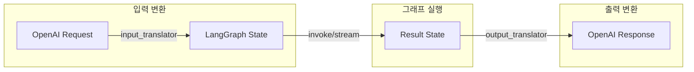
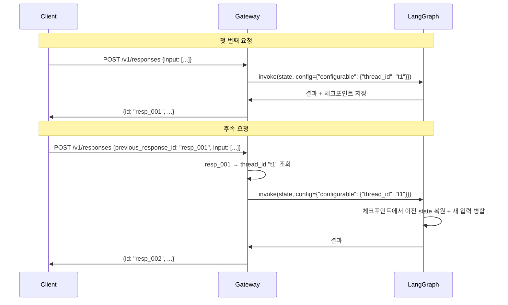

# 06. State 매핑

## 개요

OpenAI Responses API의 요청/응답 형식과 LangGraph 그래프의 State 간 변환 규칙을 정의합니다.
자동 변환(기본 `messages` 필드)과 커스텀 매퍼 함수 등록 방법을 설명합니다.

---

## 변환 흐름



---

## 1. 입력 변환 (OpenAI → LangGraph)

### 자동 변환: messages 필드

`input` 배열의 메시지들을 LangGraph의 `messages` 상태 필드로 자동 변환합니다.

| OpenAI 입력 | LangGraph State |
|------------|----------------|
| `input[].role = "user"` | `HumanMessage` |
| `input[].role = "assistant"` | `AIMessage` |
| `input[].role = "system"` | `SystemMessage` |
| `input[].role = "developer"` | `SystemMessage` (developer 태그) |
| `instructions` | `SystemMessage` (messages 앞에 삽입) |

#### 예시: 기본 변환

**OpenAI 요청:**
```json
{
  "model": "main-chat",
  "instructions": "한국어로 답변해주세요.",
  "input": [
    {"role": "user", "content": "안녕하세요"}
  ]
}
```

**변환된 LangGraph State:**
```python
{
    "messages": [
        SystemMessage(content="한국어로 답변해주세요."),
        HumanMessage(content="안녕하세요"),
    ]
}
```

#### 멀티모달 컨텐츠 변환

```json
{
  "role": "user",
  "content": [
    {"type": "input_text", "text": "이 이미지를 설명해주세요"},
    {"type": "input_image", "image_url": "https://example.com/img.png"}
  ]
}
```

```python
HumanMessage(content=[
    {"type": "text", "text": "이 이미지를 설명해주세요"},
    {"type": "image_url", "image_url": {"url": "https://example.com/img.png"}},
])
```

### 추가 필드 매핑

| OpenAI 필드 | LangGraph State 필드 | 변환 규칙 |
|------------|---------------------|----------|
| `model` | — | 그래프 선택에 사용 (State에 포함하지 않음) |
| `temperature` | `temperature` (선택적) | 커스텀 매퍼에서 처리 |
| `max_output_tokens` | `max_tokens` (선택적) | 커스텀 매퍼에서 처리 |
| `tools` | `tools` (선택적) | 커스텀 매퍼에서 처리 |
| `metadata` | `metadata` (선택적) | 커스텀 매퍼에서 처리 |
| `previous_response_id` | 체크포인트 복원 | `thread_id`로 변환하여 이전 상태 복원 |

---

## 2. 출력 변환 (LangGraph → OpenAI)

### 자동 변환: messages → output

그래프 실행 결과의 `messages` 필드에서 **마지막 AIMessage**를 추출하여 OpenAI 응답 형식으로 변환합니다.

| LangGraph State | OpenAI 출력 |
|----------------|-------------|
| `AIMessage(content="...")` | `output[].type = "message"`, `content[].type = "output_text"` |
| `AIMessage(tool_calls=[...])` | `output[].type = "function_call"` |

#### 예시: 기본 변환

**LangGraph 결과 State:**
```python
{
    "messages": [
        HumanMessage(content="안녕하세요"),
        AIMessage(content="안녕하세요! 무엇을 도와드릴까요?"),
    ]
}
```

**변환된 OpenAI 응답:**
```json
{
  "id": "resp_abc123",
  "object": "response",
  "status": "completed",
  "output": [
    {
      "type": "message",
      "id": "msg_abc123",
      "role": "assistant",
      "content": [
        {
          "type": "output_text",
          "text": "안녕하세요! 무엇을 도와드릴까요?"
        }
      ]
    }
  ]
}
```

### 도구 호출 변환

```python
AIMessage(
    content="",
    tool_calls=[{
        "id": "call_abc123",
        "name": "get_weather",
        "args": {"city": "서울"}
    }]
)
```

```json
{
  "output": [
    {
      "type": "function_call",
      "id": "fc_abc123",
      "call_id": "call_abc123",
      "name": "get_weather",
      "arguments": "{\"city\": \"서울\"}",
      "status": "completed"
    }
  ]
}
```

---

## 3. 커스텀 State 매퍼

기본 `messages` 변환으로 충분하지 않을 때, 커스텀 매퍼 함수를 등록하여 변환 로직을 확장합니다.

### 매퍼 인터페이스

```python
from typing import Any
from langgraph_openai_api.translators.state_mapper import (
    register_input_mapper,
    register_output_mapper,
)

# 입력 매퍼: OpenAI 요청 → LangGraph State (dict)
def my_input_mapper(request: dict[str, Any]) -> dict[str, Any]:
    """OpenAI 요청을 LangGraph State로 변환합니다."""
    messages = request.get("messages", [])  # 이미 변환된 LangChain 메시지
    metadata = request.get("metadata", {})

    return {
        "messages": messages,
        "model": metadata.get("llm_model", "gpt-4o"),
        "rag_mode": metadata.get("rag_mode", "auto"),
        "collection_targets": metadata.get("collections", []),
    }

# 출력 매퍼: LangGraph State → 출력 텍스트
def my_output_mapper(state: dict[str, Any]) -> str:
    """LangGraph State에서 최종 출력 텍스트를 추출합니다."""
    # 기본: messages의 마지막 AIMessage
    # 커스텀: state의 response 필드 등
    return state.get("response", "") or state["messages"][-1].content

# 그래프 ID에 대해 매퍼 등록
register_input_mapper("main-chat", my_input_mapper)
register_output_mapper("main-chat", my_output_mapper)
```

### 매퍼 등록 방법

매퍼는 그래프 모듈에서 등록합니다. `langgraph.json`이 가리키는 그래프 파일에 매퍼 등록 코드를 포함합니다.

```python
# src/agents/main_chat/graph.py

from langgraph.graph import StateGraph
from langgraph_openai_api.translators.state_mapper import (
    register_input_mapper,
    register_output_mapper,
)
from .state import ChatState, InputState

# 그래프 정의
builder = StateGraph(ChatState, input=InputState)
# ... 노드, 엣지 추가 ...
graph = builder.compile()

# 커스텀 매퍼 등록
def input_mapper(request: dict) -> dict:
    messages = request["messages"]
    return {
        "messages": messages,
        "model": request.get("metadata", {}).get("llm_model", "gpt-4o"),
    }

def output_mapper(state: dict) -> str:
    return state.get("response", state["messages"][-1].content)

register_input_mapper("main-chat", input_mapper)
register_output_mapper("main-chat", output_mapper)
```

---

## 4. InputState / FullState 패턴

LangGraph의 `InputState`/`FullState` 패턴을 활용하면, 외부 입력 필드와 내부 처리 필드를 깔끔하게 분리할 수 있습니다.

### 패턴 구조

```python
from typing import Annotated, Any
from langchain_core.messages import AnyMessage
from langgraph.graph.message import add_messages
from typing_extensions import TypedDict


class InputState(TypedDict, total=False):
    """외부 입력 필드 — API 요청에서 받는 값."""
    messages: Annotated[list[AnyMessage], add_messages]
    model: str
    thread_id: str


class FullState(InputState):
    """내부 처리 필드 포함 — 그래프 내부에서만 사용."""
    # RAG 결과
    rag_context: str
    rag_chunks: list[dict[str, Any]]

    # 최종 응답
    response: str
    usage: dict[str, Any]
```

### 그래프에 적용

```python
builder = StateGraph(FullState, input=InputState)
```

이렇게 하면:
- API 요청 시 `InputState` 필드만 받을 수 있음
- 그래프 내부에서는 `FullState`의 모든 필드 사용 가능
- 입력 매퍼는 `InputState` 필드에 맞춰 변환
- 출력 매퍼는 `FullState` 전체에서 결과 추출

---

## 5. previous_response_id와 대화 연속성

OpenAI의 `previous_response_id`는 LangGraph의 **체크포인트 시스템**과 매핑됩니다.

### 변환 흐름



### 매핑 규칙

| OpenAI | LangGraph |
|--------|----------|
| `response_id` | 내부 매핑 테이블 (`response_id → thread_id`) |
| `previous_response_id` | `config.configurable.thread_id` |
| 대화 히스토리 | 체크포인트에서 자동 복원 |

---

## 관련 문서

- [04. 내부 아키텍처](./04-architecture.md) - translators 모듈 구조
- [05. API 명세](./05-api-specification.md) - 요청/응답 형식
- [07. 스트리밍](./07-streaming.md) - 스트리밍 변환
- [Appendix B. OpenAI API 참조](./appendix/B-openai-api-reference.md) - 원본 API 형식
