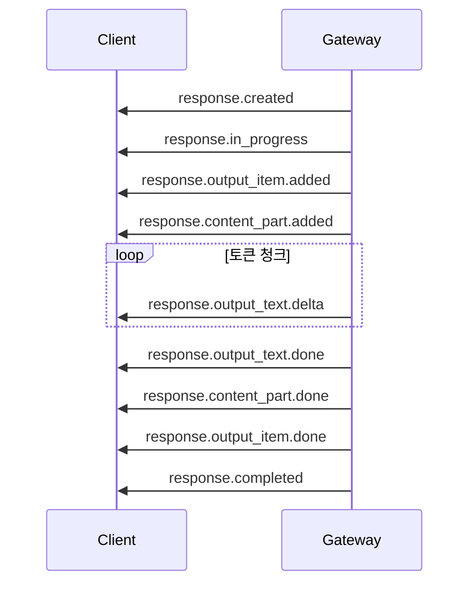
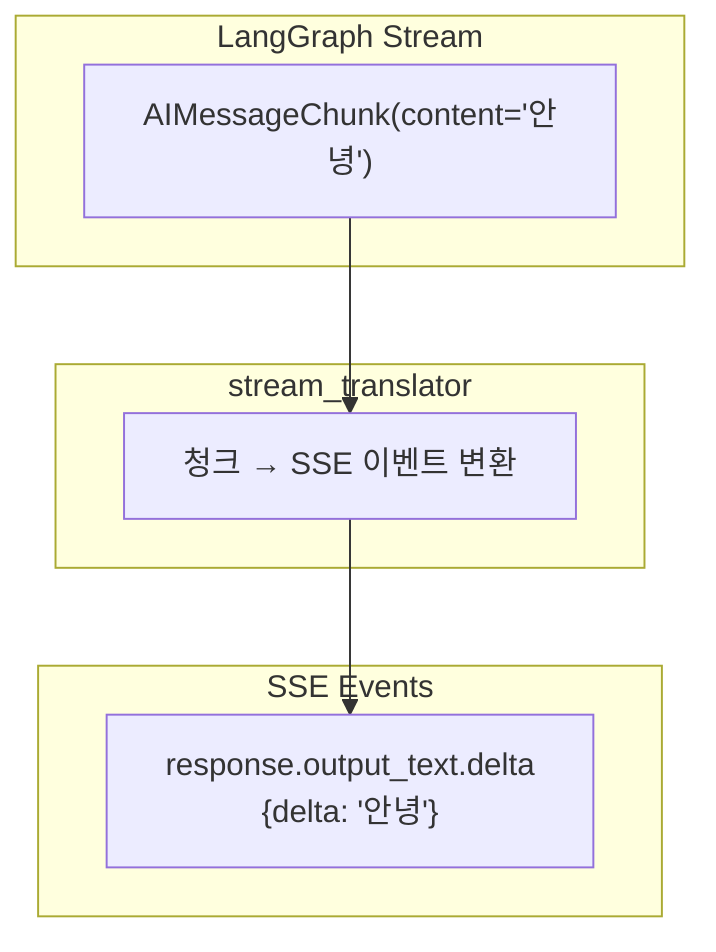

# 07. 스트리밍

## 개요

OpenAI Responses API의 SSE(Server-Sent Events) 스트리밍 프로토콜과
LangGraph의 `astream` 메시지 모드를 매핑하는 방법을 정의합니다.

---

## SSE 프로토콜

### 기본 형식

SSE 이벤트는 `event:`와 `data:` 라인으로 구성됩니다.

```
event: response.output_text.delta
data: {"type":"response.output_text.delta","item_id":"msg_001","output_index":0,"content_index":0,"delta":"안녕"}

event: response.output_text.delta
data: {"type":"response.output_text.delta","item_id":"msg_001","output_index":0,"content_index":0,"delta":"하세요"}

```

각 이벤트 사이는 빈 줄(`\n\n`)로 구분합니다.

### Content-Type

```
Content-Type: text/event-stream
Cache-Control: no-cache
Connection: keep-alive
```

---

## OpenAI SSE 이벤트 시퀀스

### 전체 이벤트 흐름

일반적인 텍스트 응답의 이벤트 순서:



### 이벤트 타입 상세

#### 응답 라이프사이클 이벤트

| 이벤트 | 설명 | 데이터 내용 |
|--------|------|------------|
| `response.created` | 응답 객체 생성 | 전체 Response 객체 (status: `in_progress`) |
| `response.in_progress` | 처리 시작 | 전체 Response 객체 |
| `response.completed` | 처리 완료 | 전체 Response 객체 (usage 포함) |
| `response.failed` | 처리 실패 | 전체 Response 객체 (error 포함) |
| `response.cancelled` | 취소됨 | 전체 Response 객체 |
| `response.incomplete` | 불완전 종료 | 전체 Response 객체 (incomplete_details 포함) |

#### 출력 항목 이벤트

| 이벤트 | 설명 | 데이터 내용 |
|--------|------|------------|
| `response.output_item.added` | 출력 항목 추가 | `output_index`, `item` |
| `response.output_item.done` | 출력 항목 완료 | `output_index`, `item` (완전체) |

#### 콘텐츠 파트 이벤트

| 이벤트 | 설명 | 데이터 내용 |
|--------|------|------------|
| `response.content_part.added` | 콘텐츠 파트 시작 | `item_id`, `output_index`, `content_index`, `part` |
| `response.content_part.done` | 콘텐츠 파트 완료 | `item_id`, `output_index`, `content_index`, `part` (완전체) |

#### 텍스트 델타 이벤트

| 이벤트 | 설명 | 데이터 내용 |
|--------|------|------------|
| `response.output_text.delta` | 텍스트 토큰 청크 | `item_id`, `output_index`, `content_index`, `delta` |
| `response.output_text.done` | 전체 텍스트 완료 | `item_id`, `output_index`, `content_index`, `text` (전체) |

#### 함수 호출 이벤트

| 이벤트 | 설명 | 데이터 내용 |
|--------|------|------------|
| `response.function_call_arguments.delta` | 함수 인자 청크 | `item_id`, `output_index`, `delta` |
| `response.function_call_arguments.done` | 함수 인자 완료 | `item_id`, `output_index`, `arguments` (전체) |

---

## LangGraph 스트림 모드 매핑

### LangGraph의 astream

LangGraph의 `astream(state, stream_mode="messages")` 는 `(message_chunk, metadata)` 튜플을 생성합니다.

```python
async for chunk, metadata in graph.astream(
    state,
    config=config,
    stream_mode="messages",
):
    # chunk: AIMessageChunk (LangChain 메시지 청크)
    # metadata: {"langgraph_node": "chatbot", ...}
    pass
```

### 변환 매핑



### 변환 규칙 상세

| LangGraph 이벤트 | 조건 | SSE 이벤트 |
|-----------------|------|-----------|
| 첫 번째 청크 수신 전 | — | `response.created` + `response.in_progress` |
| 첫 번째 `AIMessageChunk` | `content != ""` | `response.output_item.added` + `response.content_part.added` |
| `AIMessageChunk(content="토큰")` | 텍스트 콘텐츠 | `response.output_text.delta` |
| `AIMessageChunk(tool_calls=[...])` | 도구 호출 시작 | `response.output_item.added` (type: function_call) |
| `AIMessageChunk(tool_call_chunks=[...])` | 도구 인자 청크 | `response.function_call_arguments.delta` |
| 스트림 종료 | — | `response.output_text.done` + `response.content_part.done` + `response.output_item.done` + `response.completed` |
| 예외 발생 | — | `response.failed` |

---

## 구현 가이드

### FastAPI StreamingResponse

```python
from fastapi import APIRouter
from fastapi.responses import StreamingResponse

router = APIRouter()

@router.post("/v1/responses")
async def create_response(request: CreateResponseRequest):
    if request.stream:
        return StreamingResponse(
            stream_response(request),
            media_type="text/event-stream",
            headers={
                "Cache-Control": "no-cache",
                "Connection": "keep-alive",
            },
        )
    # 비스트리밍 응답
    return await invoke_response(request)
```

### SSE 이벤트 생성기

```python
import json
from typing import AsyncGenerator


def format_sse(event_type: str, data: dict) -> str:
    """SSE 이벤트를 포맷합니다."""
    return f"event: {event_type}\ndata: {json.dumps(data, ensure_ascii=False)}\n\n"


async def stream_response(request: CreateResponseRequest) -> AsyncGenerator[str, None]:
    """LangGraph 스트림을 SSE 이벤트로 변환합니다."""
    response_id = generate_response_id()
    message_id = generate_message_id()

    # 1. 응답 생성 이벤트
    response_obj = create_initial_response(response_id, request)
    yield format_sse("response.created", response_obj)
    yield format_sse("response.in_progress", response_obj)

    # 2. 출력 항목 시작
    output_item = {
        "type": "message",
        "id": message_id,
        "status": "in_progress",
        "role": "assistant",
        "content": [],
    }
    yield format_sse("response.output_item.added", {
        "type": "response.output_item.added",
        "output_index": 0,
        "item": output_item,
    })

    # 3. 콘텐츠 파트 시작
    content_part = {"type": "output_text", "text": "", "annotations": []}
    yield format_sse("response.content_part.added", {
        "type": "response.content_part.added",
        "item_id": message_id,
        "output_index": 0,
        "content_index": 0,
        "part": content_part,
    })

    # 4. 텍스트 델타 스트리밍
    full_text = ""
    graph = get_graph(request.model)
    state = translate_input(request)

    async for chunk, metadata in graph.astream(state, stream_mode="messages"):
        if hasattr(chunk, "content") and chunk.content:
            delta = chunk.content
            full_text += delta
            yield format_sse("response.output_text.delta", {
                "type": "response.output_text.delta",
                "item_id": message_id,
                "output_index": 0,
                "content_index": 0,
                "delta": delta,
            })

    # 5. 종료 이벤트 시퀀스
    yield format_sse("response.output_text.done", {
        "type": "response.output_text.done",
        "item_id": message_id,
        "output_index": 0,
        "content_index": 0,
        "text": full_text,
    })
    yield format_sse("response.content_part.done", {
        "type": "response.content_part.done",
        "item_id": message_id,
        "output_index": 0,
        "content_index": 0,
        "part": {"type": "output_text", "text": full_text, "annotations": []},
    })
    yield format_sse("response.output_item.done", {
        "type": "response.output_item.done",
        "output_index": 0,
        "item": {**output_item, "status": "completed", "content": [
            {"type": "output_text", "text": full_text, "annotations": []}
        ]},
    })
    yield format_sse("response.completed", {
        **response_obj,
        "status": "completed",
        "output": [{**output_item, "status": "completed", "content": [
            {"type": "output_text", "text": full_text, "annotations": []}
        ]}],
    })
```

---

## 도구 호출 스트리밍

도구를 사용하는 그래프에서의 스트리밍 이벤트 시퀀스:

```
event: response.created
event: response.in_progress

# 도구 호출
event: response.output_item.added         {type: "function_call", name: "get_weather"}
event: response.function_call_arguments.delta  {delta: '{"city':}
event: response.function_call_arguments.delta  {delta: ': "서울"}'}
event: response.function_call_arguments.done   {arguments: '{"city": "서울"}'}
event: response.output_item.done

# 최종 메시지
event: response.output_item.added         {type: "message"}
event: response.content_part.added
event: response.output_text.delta          {delta: "서울의 날씨는..."}
event: response.output_text.done
event: response.content_part.done
event: response.output_item.done

event: response.completed
```

---

## 에러 처리

스트리밍 중 에러 발생 시:

```python
async def stream_response(request):
    try:
        # ... 스트리밍 로직 ...
        pass
    except Exception as e:
        yield format_sse("error", {
            "type": "error",
            "message": str(e),
            "code": "server_error",
        })
        yield format_sse("response.failed", {
            **response_obj,
            "status": "failed",
            "error": {
                "type": "server_error",
                "message": str(e),
            },
        })
```

---

## 관련 문서

- [05. API 명세](./05-api-specification.md) - 엔드포인트 전체 스펙
- [06. State 매핑](./06-state-mapping.md) - 입출력 변환 규칙
- [04. 내부 아키텍처](./04-architecture.md) - stream_translator 모듈
- [Appendix B. OpenAI API 참조](./appendix/B-openai-api-reference.md) - 원본 SSE 이벤트
