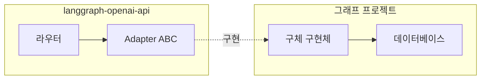

# 08. 스토리지 어댑터

## 개요

벡터 스토어와 파일 관리를 위한 어댑터 패턴을 정의합니다.
게이트웨이는 OpenAI 형식 변환만 담당하고, 실제 데이터 처리는 어댑터 구현체에 위임합니다.

---

## 설계 원칙

| 원칙 | 설명 |
|------|------|
| 형식 변환만 | 게이트웨이는 OpenAI API 형식 ↔ 내부 형식 변환만 수행 |
| 구현 위임 | 실제 CRUD/검색은 어댑터 구현체가 처리 |
| ABC 인터페이스 | 추상 기본 클래스로 인터페이스 정의 |
| 그래프 프로젝트 구현 | 어댑터 구체 구현은 그래프 프로젝트에서 제공 |



---

## VectorStoreAdapter ABC

### 인터페이스 정의

```python
from abc import ABC, abstractmethod
from typing import Any


class VectorStoreAdapter(ABC):
    """벡터 스토어 CRUD + 검색 어댑터 인터페이스."""

    # --- 벡터 스토어 CRUD ---

    @abstractmethod
    async def create_vector_store(
        self,
        name: str | None = None,
        file_ids: list[str] | None = None,
        metadata: dict[str, str] | None = None,
        chunking_strategy: dict[str, Any] | None = None,
        expires_after: dict[str, Any] | None = None,
    ) -> dict[str, Any]:
        """벡터 스토어를 생성합니다.

        Returns:
            {
                "id": "vs_...",
                "name": "...",
                "status": "completed",
                "file_counts": {"total": 0, "completed": 0, ...},
                "usage_bytes": 0,
                "created_at": 1699061776,
                "metadata": {},
            }
        """
        ...

    @abstractmethod
    async def list_vector_stores(
        self,
        limit: int = 20,
        order: str = "desc",
        after: str | None = None,
        before: str | None = None,
    ) -> dict[str, Any]:
        """벡터 스토어 목록을 반환합니다.

        Returns:
            {
                "data": [...],
                "has_more": False,
                "first_id": "vs_...",
                "last_id": "vs_...",
            }
        """
        ...

    @abstractmethod
    async def get_vector_store(self, vector_store_id: str) -> dict[str, Any]:
        """벡터 스토어를 조회합니다."""
        ...

    @abstractmethod
    async def modify_vector_store(
        self,
        vector_store_id: str,
        name: str | None = None,
        metadata: dict[str, str] | None = None,
        expires_after: dict[str, Any] | None = None,
    ) -> dict[str, Any]:
        """벡터 스토어를 수정합니다."""
        ...

    @abstractmethod
    async def delete_vector_store(self, vector_store_id: str) -> dict[str, Any]:
        """벡터 스토어를 삭제합니다.

        Returns:
            {"id": "vs_...", "deleted": True}
        """
        ...

    # --- 벡터 스토어 검색 ---

    @abstractmethod
    async def search_vector_store(
        self,
        vector_store_id: str,
        query: str,
        max_num_results: int = 10,
        filters: dict[str, Any] | None = None,
        ranking_options: dict[str, Any] | None = None,
    ) -> dict[str, Any]:
        """벡터 스토어를 검색합니다.

        Returns:
            {
                "data": [
                    {
                        "file_id": "file_...",
                        "filename": "...",
                        "score": 0.92,
                        "content": [{"type": "text", "text": "..."}],
                        "attributes": {},
                    }
                ]
            }
        """
        ...

    # --- 벡터 스토어 파일 CRUD ---

    @abstractmethod
    async def add_file_to_vector_store(
        self,
        vector_store_id: str,
        file_id: str,
        chunking_strategy: dict[str, Any] | None = None,
        attributes: dict[str, Any] | None = None,
    ) -> dict[str, Any]:
        """벡터 스토어에 파일을 추가합니다."""
        ...

    @abstractmethod
    async def list_vector_store_files(
        self,
        vector_store_id: str,
        limit: int = 20,
        order: str = "desc",
        after: str | None = None,
    ) -> dict[str, Any]:
        """벡터 스토어 파일 목록을 반환합니다."""
        ...

    @abstractmethod
    async def get_vector_store_file(
        self,
        vector_store_id: str,
        file_id: str,
    ) -> dict[str, Any]:
        """벡터 스토어 파일을 조회합니다."""
        ...

    @abstractmethod
    async def delete_vector_store_file(
        self,
        vector_store_id: str,
        file_id: str,
    ) -> dict[str, Any]:
        """벡터 스토어에서 파일을 삭제합니다."""
        ...
```

---

## FileAdapter ABC

### 인터페이스 정의

```python
from abc import ABC, abstractmethod
from typing import Any


class FileAdapter(ABC):
    """파일 업로드/관리 어댑터 인터페이스."""

    @abstractmethod
    async def upload_file(
        self,
        file_content: bytes,
        filename: str,
        purpose: str,
    ) -> dict[str, Any]:
        """파일을 업로드합니다.

        Args:
            file_content: 파일 바이너리 데이터
            filename: 파일명
            purpose: 용도 ("assistants", "batch", "user_data" 등)

        Returns:
            {
                "id": "file_...",
                "filename": "...",
                "bytes": 12345,
                "purpose": "assistants",
                "created_at": 1699061776,
            }
        """
        ...

    @abstractmethod
    async def list_files(
        self,
        purpose: str | None = None,
        limit: int = 10000,
        order: str = "desc",
        after: str | None = None,
    ) -> dict[str, Any]:
        """파일 목록을 반환합니다.

        Returns:
            {"data": [...], "has_more": False}
        """
        ...

    @abstractmethod
    async def get_file(self, file_id: str) -> dict[str, Any]:
        """파일 메타데이터를 조회합니다."""
        ...

    @abstractmethod
    async def delete_file(self, file_id: str) -> dict[str, Any]:
        """파일을 삭제합니다.

        Returns:
            {"id": "file_...", "deleted": True}
        """
        ...

    @abstractmethod
    async def get_file_content(self, file_id: str) -> bytes:
        """파일 콘텐츠를 다운로드합니다.

        Returns:
            파일 바이너리 데이터
        """
        ...
```

---

## 어댑터 등록

### 설정 기반 등록

`langgraph.json` 또는 앱 설정에서 어댑터 구현체를 등록합니다.

```python
# app_config.py

from langgraph_openai_api.server.app import create_app
from my_project.adapters import QdrantVectorStoreAdapter, S3FileAdapter

app = create_app(
    vector_store_adapter=QdrantVectorStoreAdapter(
        url="http://localhost:6333",
        collection_prefix="vs_",
    ),
    file_adapter=S3FileAdapter(
        bucket="my-files",
        region="ap-northeast-2",
    ),
)
```

### 기본값 (개발용)

어댑터를 등록하지 않으면 인메모리 참조 구현이 사용됩니다.

```python
# adapters/memory.py — 개발/테스트용 인메모리 구현

class InMemoryVectorStoreAdapter(VectorStoreAdapter):
    """인메모리 벡터 스토어 어댑터 (개발용)."""

    def __init__(self):
        self._stores: dict[str, dict] = {}
        self._files: dict[str, dict[str, dict]] = {}

    async def create_vector_store(self, name=None, **kwargs):
        store_id = f"vs_{generate_id()}"
        self._stores[store_id] = {
            "id": store_id,
            "name": name or "",
            "status": "completed",
            "created_at": int(time.time()),
            "file_counts": {"total": 0, "completed": 0, "failed": 0, "cancelled": 0, "in_progress": 0},
            "usage_bytes": 0,
            "metadata": kwargs.get("metadata", {}),
        }
        return self._stores[store_id]

    async def list_vector_stores(self, limit=20, order="desc", **kwargs):
        stores = sorted(
            self._stores.values(),
            key=lambda s: s["created_at"],
            reverse=(order == "desc"),
        )[:limit]
        return {
            "data": stores,
            "has_more": len(self._stores) > limit,
            "first_id": stores[0]["id"] if stores else None,
            "last_id": stores[-1]["id"] if stores else None,
        }

    # ... 나머지 메서드 구현 ...
```

---

## 구현 예제: Qdrant 벡터 스토어

```python
from qdrant_client import AsyncQdrantClient
from langgraph_openai_api.adapters.base import VectorStoreAdapter


class QdrantVectorStoreAdapter(VectorStoreAdapter):
    """Qdrant 기반 벡터 스토어 어댑터."""

    def __init__(self, url: str, collection_prefix: str = "vs_"):
        self.client = AsyncQdrantClient(url=url)
        self.prefix = collection_prefix

    async def create_vector_store(self, name=None, **kwargs):
        store_id = f"vs_{generate_id()}"
        collection_name = f"{self.prefix}{store_id}"

        await self.client.create_collection(
            collection_name=collection_name,
            vectors_config={"size": 1536, "distance": "Cosine"},
        )

        # 메타데이터 저장 (별도 테이블 또는 collection payload)
        return {
            "id": store_id,
            "name": name or "",
            "status": "completed",
            "created_at": int(time.time()),
            "file_counts": {"total": 0, "completed": 0, "failed": 0, "cancelled": 0, "in_progress": 0},
            "usage_bytes": 0,
            "metadata": kwargs.get("metadata", {}),
        }

    async def search_vector_store(self, vector_store_id, query, max_num_results=10, **kwargs):
        collection_name = f"{self.prefix}{vector_store_id}"

        # 쿼리 임베딩 생성 (외부 의존)
        query_vector = await self._embed(query)

        results = await self.client.search(
            collection_name=collection_name,
            query_vector=query_vector,
            limit=max_num_results,
        )

        return {
            "data": [
                {
                    "file_id": r.payload.get("file_id", ""),
                    "filename": r.payload.get("filename", ""),
                    "score": r.score,
                    "content": [{"type": "text", "text": r.payload.get("text", "")}],
                    "attributes": r.payload.get("attributes", {}),
                }
                for r in results
            ]
        }

    # ... 나머지 메서드 구현 ...
```

---

## 구현 예제: S3 파일 어댑터

```python
import aioboto3
from langgraph_openai_api.adapters.base import FileAdapter


class S3FileAdapter(FileAdapter):
    """AWS S3 기반 파일 어댑터."""

    def __init__(self, bucket: str, region: str = "ap-northeast-2"):
        self.bucket = bucket
        self.region = region
        self.session = aioboto3.Session()

    async def upload_file(self, file_content, filename, purpose):
        file_id = f"file_{generate_id()}"
        key = f"{purpose}/{file_id}/{filename}"

        async with self.session.client("s3", region_name=self.region) as s3:
            await s3.put_object(
                Bucket=self.bucket,
                Key=key,
                Body=file_content,
            )

        return {
            "id": file_id,
            "filename": filename,
            "bytes": len(file_content),
            "purpose": purpose,
            "created_at": int(time.time()),
        }

    async def get_file_content(self, file_id):
        key = await self._resolve_key(file_id)

        async with self.session.client("s3", region_name=self.region) as s3:
            response = await s3.get_object(Bucket=self.bucket, Key=key)
            return await response["Body"].read()

    # ... 나머지 메서드 구현 ...
```

---

## 어댑터 반환값 → OpenAI 형식 변환

라우터에서 어댑터 반환값을 OpenAI 형식으로 변환합니다.

```python
# routers/vector_stores.py

@router.post("/v1/vector_stores")
async def create_vector_store(
    request: CreateVectorStoreRequest,
    adapter: VectorStoreAdapter = Depends(get_vector_store_adapter),
):
    result = await adapter.create_vector_store(
        name=request.name,
        file_ids=request.file_ids,
        metadata=request.metadata,
    )

    return VectorStoreObject(
        id=result["id"],
        object="vector_store",
        created_at=result["created_at"],
        name=result["name"],
        status=result["status"],
        file_counts=result["file_counts"],
        usage_bytes=result["usage_bytes"],
        metadata=result.get("metadata", {}),
    )
```

---

## 관련 문서

- [04. 내부 아키텍처](./04-architecture.md) - adapters 모듈 구조
- [05. API 명세](./05-api-specification.md) - 벡터 스토어/파일 엔드포인트 스펙
- [03. 설정](./03-configuration.md) - 어댑터 설정
- [예제: RAG + Vector Store](./examples/rag-vector-store.md) - 실전 어댑터 예제
